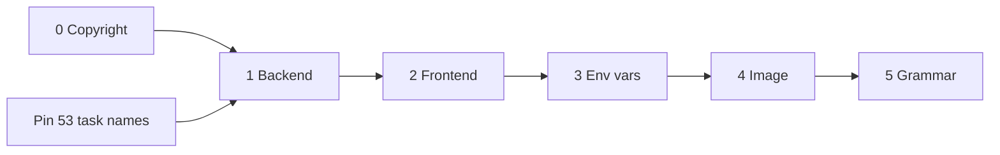

# Renaming `baserow` to `jadawel`

The fork has diverged far enough that carrying the upstream name inside the code no
longer describes what this is. This plan takes the name out of every layer — source
package, import alias, environment variables, and the image filesystem — while keeping
the attribution the MIT licence requires.

## Decisions

| Decision | Value | Why |
|---|---|---|
| Identifier | `jadawel` | 1,150 existing uses, `package.json` name, the CranL app, the GHCR path, both managed databases. Only `jadawl.site` disagrees, and a short domain is not a package name. |
| Depth | Everything, including image internals | Phases 1–5 below. |
| `arabase` | Stays | It marks fork-authored code apart from upstream-derived code, which keeps `PATCHES.md` meaningful and keeps an upstream security cherry-pick tractable. |
| Upstream | Severed, formally | See below. |

### Upstream is already severed

`.git/config` declares one remote — `origin` → `Azizahmed/jadawel_cranl`. There is no
`upstream`. `git merge upstream/develop` cannot run today, so the quarterly-merge
capability `PATCHES.md` protects is aspirational, not live.

That matters because the rename would end it regardless: 1,699 files under
`backend/src/baserow` plus 515 under `backend/tests/baserow` become rename-conflicted,
and git's `diff.renameLimit` (1,000 by default for merges) silently degrades a
2,214-file directory move to delete-plus-add, so every upstream hunk arrives as
add/add.

The rename therefore **formalises a choice already made** rather than closing a door
that was open. `PATCHES.md` changes job: it stops being a merge-cost ledger and becomes
a provenance record of which files came from upstream. Keep writing to it — the
question "did we author this or inherit it?" still decides how a CVE gets patched.

## Size

`baserow` appears **55,702 times across 3,046 files**. Almost all of it is mechanical.

| Layer | Occurrences | Concentration |
|---|---|---|
| Backend imports | 7,154 statements in 1,349 files | One regex on `^\s*(from\|import)\s+baserow` |
| Backend dotted strings | 127 in 79 files | 33 of them in `config/settings/base.py` alone |
| Backend migrations | 81 of 456 files | Deconstructed field paths only |
| Frontend `@baserow/` alias | 3,749 in 1,191 files | Declared on **one line**: `modules/core/module.js:46` |
| Env variables | 176 distinct `BASEROW_*` | 5 set in CranL |
| e2e Postgres dump | 4,680 in one binary fixture | `e2e-tests/fixtures/e2e-db.dump` |
| ANTLR generated parsers | 758 in 8 files | Regenerated from the grammar filename |

### The database does not move

Django derives `app_label` from the **last** dotted segment of `AppConfig.name`. All
nine AppConfigs declare `name` only, none sets `label`, so `baserow.core` → 
`jadawel.core` still yields app_label `core`.

Consequences, each verified: zero `AlterModelTable` operations exist; zero models pin a
literal `db_table`; all 456 migration dependency tuples draw from
`{arabase, automation, builder, contenttypes, core, dashboard, database, integrations}`
and never name `baserow`; every dynamic user table is prefixed `database_table_`.
`django_migrations.app`, `django_content_type.app_label` and `auth_permission.codename`
are untouched.

**No migration. No downtime for the schema.** The 81 migration files still need text
edits, but `django_migrations` stores only `(app, name, applied)`, so the graph stays
green.

---

## Phase 0 — Restore the copyright notice

Independent of the rename and the reason this document leads with it.

`backend/src/baserow/contrib/database/fields/dependencies/circular_reference_checker.py:15`
reads `# Copyright (c) 2019-present Jadawel B.V.` on a file authored upstream. An
earlier pass overwrote `Baserow B.V.` there. `LICENSE:27-28` is unambiguous:

> The above copyright notice and this permission notice shall be included in all
> copies or substantial portions of the Software.

Restore `Baserow B.V.` on that line. It is the only occurrence in the tree, and the
only place the fork strips attribution rather than adding its own.

MIT grants the right to modify, rebrand and redistribute, and grants nothing in the
*Baserow* trademark — which is exactly why removing branding is correct and removing
attribution is not. Keep `LICENSE` verbatim. Keep the third-party notice at
`formula/BaserowFormulaLexer.g4:1-21` (Copyright 2018 Tal Shprecher).

**Done when:** `git grep "Jadawel B.V."` returns nothing and `LICENSE` is unmodified.

## Phase 1 — Backend package

`backend/src/baserow` → `backend/src/jadawel`.

**Pin the Celery task names first.** 53 `@app.task` / `@shared_task` decorators carry
no explicit `name=`, so Celery derives the name from the module path. Renaming the
package renames all 53. Any message already queued in Redis under
`baserow.core.trash.tasks.…` becomes unroutable and the new workers log
`Received unregistered task`. Two ways out — take the first:

1. Add `name="baserow.…"` to all 53 decorators in a **separate preceding commit**, so
   the wire format stops depending on the module path. Rewrite the 7
   `CELERY_TASK_ROUTES` keys (`config/settings/base.py:192-202`) in the same commit, or
   those tasks silently fall back to the `celery` queue instead of `export`.
2. Or drain every queue at cutover and accept the loss of in-flight work.

Then, in order:

| Step | Detail |
|---|---|
| Move | `git mv backend/src/baserow backend/src/jadawel`; `git mv backend/tests/baserow backend/tests/jadawel` |
| Imports | 7,154 statements. Use `ast_edit`, not `sed` — a text pass also hits `local_baserow`, `LocalBaserow*` and prose |
| Dotted strings | 127 across 79 files. `INSTALLED_APPS`, `MIDDLEWARE`, `ROOT_URLCONF`, `WSGI_APPLICATION`, `ASGI_APPLICATION`, `DATABASE_ROUTERS`, DRF auth/schema/throttle classes, 28 × `urls.py` `app_name`, 6 × `api/extensions.py` `target_class` |
| AppConfigs | 8 × `name = "baserow.…"` → `"jadawel.…"`, plus the matching `INSTALLED_APPS` entries. Leave `arabase` |
| Migrations | 81 files, deconstructed paths. `baserow.core.formula.field.FormulaField` (74), `baserow.core.fields.SyncedDateTimeField` (29), `PolymorphicContentTypeMixin` (17), and ~50 more |
| Celery app | `config/celery.py:8` `Celery("baserow")` → `Celery("jadawel")`, matched by `celery -A jadawel` in `backend/justfile` (5 sites) and `backend/docker/docker-entrypoint.sh:219` |
| Packaging | `pyproject.toml` — distribution name, `[project.scripts]`, hatch version path, wheel packages, ruff per-file-ignores, isort `known-first-party`, pytest settings module. Delete the load-bearing NOTE at `:6-9`; this plan supersedes it |
| Lock | `uv lock`. Both Dockerfile stages run `uv sync --frozen`, so a stale lock hard-fails the build |
| Shim | `git mv backend/baserow backend/jadawel` and rewrite its one import |
| Config | `mypy.ini`, `pytest.ini` (twice), `backend/justfile` (33), `.github/workflows/jadawel-ci.yml` |

Sweep the dead `premium/` and `enterprise/` paths still listed in `mypy.ini:7` and
`pytest.ini` `testpaths` while you are in those files.

**Done when:** `uv run python src/jadawel/manage.py check` passes, `just b test -n=auto`
is green, `makemigrations --check` reports no changes, and `git grep -l "^\s*from baserow"`
is empty.

## Phase 2 — Frontend alias

One line does the heavy lifting: `web-frontend/modules/core/module.js:46` declares
`nuxt.options.alias['@baserow']`. Change it plus the 5 build/IDE/test mirrors and all
3,749 `@baserow/` imports re-point.

Also rename the 13 camelCase `baserow*` keys in the `runtimeConfig.public` block
(`module.js:57-90`).

**One key can break auth.** `baserowFrontendSameSiteCookie` feeds `sameSite` on the JWT
cookie at `modules/core/utils/auth.js:26,70`. Rename it in `module.js`, `env-remap.mjs`
and all three call sites together, or `sameSite` silently becomes `undefined`.

**No user is logged out.** The three auth cookies are `jwt_token`, `user_source_token`
and `user_session` (`utils/auth.js:7-9`) — none contains `baserow`, so no rename touches
them. Three browser keys do, and all three cost only a one-time reset:

| Key | Location | Cost of renaming |
|---|---|---|
| cookie `baserow_group_id` | `modules/core/utils/workspace.js:5` | Last-selected workspace forgotten once |
| `baserow.clipboardData` | `modules/database/utils/clipboard.js:10` | Next paste falls back to plain TSV |
| `baserow.rightSidebarOpen` | `modules/core/layouts/app.vue:132` | Sidebar returns to default once |

i18n needs nothing: 90 locale entries contain `baserow` and **all 90 are keys, zero are
values**. `settings.baserowVersion` already renders "Jadawel version" / "إصدار منصة جداول".
`package.json` is already named `jadawel`. No `--baserow-*` CSS custom properties exist.

**Done when:** `just f lint` and `just f test` pass, `yarn locale:check` stays green, and
a logged-in session survives a rebuild.

## Phase 3 — Environment variables

176 distinct `BASEROW_*` → `JADAWEL_*`. Only 5 are set in CranL:
`BASEROW_JWT_SIGNING_KEY`, `BASEROW_PUBLIC_URL`, `BASEROW_RUN_MINIMAL`,
`BASEROW_AMOUNT_OF_WORKERS`, `BASEROW_TRIGGER_SYNC_TEMPLATES_AFTER_MIGRATION`.

**`BASEROW_JWT_SIGNING_KEY` is the landmine.** If the new name is read and the old value
is still what the dashboard holds, the setting falls back to `SECRET_KEY`
(`config/settings/base.py:495`) and **every issued JWT is invalidated** — a silent,
total logout with no error in the log.

So: **dual-accept, then cut over.** Read the new name first and the old name as
fallback, ship that, change the 5 dashboard values, verify, then delete the fallback in
a later release. Never rename an env var and change the dashboard in the same deploy.

Touch together, or the remap breaks: `web-frontend/env-remap.mjs` (21 mappings plus
special handling for `BASEROW_PUBLIC_URL`, `BASEROW_EMBEDDED_SHARE_URL`,
`BASEROW_EXTRA_PUBLIC_URLS`, `BASEROW_BUILDER_DOMAINS`), the `NUXT_PUBLIC_BASEROW_*`
runtime-config keys, `Caddyfile` (5 vars), `deploy/all-in-one/supervisor/default_baserow_env.sh`
(22 vars), all four compose files, `deploy/helm/jadawel/values.yaml`, `.env*.example` (93),
`docs/CONFIGURATION.md`, `docs/DEPLOY_CRANL.md` and `cranl_fix.md`.

Fix `BASEROW_JOBS_FRONTEND_POLLING_TIMEOUT_MS` at `.env.example:131` while here — it is a
typo for `BASEROW_FRONTEND_JOBS_POLLING_TIMEOUT_MS` and reads nothing.

**Done when:** production boots on `JADAWEL_*` names, users stay logged in across the
cutover deploy, and `git grep BASEROW_` returns only the compatibility fallbacks.

## Phase 4 — Image internals

The `/baserow` prefix is baked into ~19 layers, the supervisor config, the healthcheck
and the Docker user's home directory.

| Identifier | Where | Note |
|---|---|---|
| `/baserow/{data,backend,venv,supervisor,caddy,web-frontend,media,static,plugins}` | `deploy/all-in-one/Dockerfile`, `backend/Dockerfile`, `web-frontend/Dockerfile`, `Caddyfile:26,125`, `Caddyfile.dev:23` | `MEDIA_ROOT` is a **mounted volume path** — see below |
| `/baserow.sh` | entrypoint, `deploy/all-in-one/baserow.sh` | `ENTRYPOINT` and the root `Dockerfile` comment move together |
| `baserow_docker_user` | 3 stages in `backend/Dockerfile`, `web-frontend/Dockerfile:106`, `default_baserow_env.sh:8`, `/etc/sudoers.d/baserow_docker_user` | Also `useradd -d /baserow` |
| `default_baserow_env.sh` | referenced by literal filename at `baserow.sh:106` | Rename both sides |
| `baserow-watcher` | `supervisor.conf:94`, `baserow-watcher.sh` | Program name plus internal `baserow_ready()` / `wait_for_baserow()` |
| `baserow_backend:dev`, `baserow_web-frontend:dev` | `docker-compose.dev.yml` (8 sites) | Local tags |
| service/container/volume `baserow`, `baserow_data` | `docker-compose.all-in-one.yml:12-23` | Delete the load-bearing comment at `:8-10`; this plan supersedes it |
| `baserow_all_in_one`, `baserow_all_in_one_data` | `deploy/all-in-one/docker-compose.yml` | |
| 8 Helm subcharts named `baserow`, aliases `baserow-backend-asgi` etc. | `deploy/helm/jadawel/Chart.yaml`, 16 `baserow.global.*` helpers in `_helpers.tpl` | Aliases render into live Service names |
| `$PGDATA/baserow_db_setup` | `docker-postgres-setup.sh:84` | Marker file in the Postgres data dir |
| `/tmp/baserow-*.{log,pid}` | `justfile:468-471` and `just dev ps` | Local only |

**Three real hazards:**

1. **`MEDIA_ROOT` `/baserow/media` is a mounted volume.** Changing it strands every
   uploaded file. Either move the data inside the volume before cutover, or set
   `MEDIA_ROOT` explicitly to the old path and rename only the code around it. On CranL
   this is currently free — no persistent volume is attached, which is also why uploads
   already die on redeploy.
2. **Helm subchart aliases render into Kubernetes Service names**
   (`{{fullname}}-baserow-backend-asgi`) and into `PRIVATE_BACKEND_URL` in
   `shared-configmap.yaml:14`. Renaming replaces live Services on any existing release.
   No cluster is deployed today, so do it now while it is free.
3. **The Helm Secret re-reads itself by key name.** `secret.yaml:25` keys on
   `BASEROW_JWT_SIGNING_KEY`; renaming the key regenerates the signing key and logs
   everyone out. Same dual-accept discipline as Phase 3.

Renaming the GitHub repository is optional but coupled: `publish-image.yml` derives the
image path from `${{ github.repository }}`, so a repo rename silently changes the
published GHCR path and the root `Dockerfile` pin must follow.

`docker-postgres-setup.sh:106` references upstream `baserow/baserow-pgautoupgrade` and
`baserow/baserow-pg11` on Docker Hub. Those are third-party image names — leave them.

**Done when:** `just dc-dev up -d` comes up clean from a cold build, the published image
boots on CranL, and an uploaded file survives the cutover.

## Phase 5 — Formula grammar and residuals

`formula/build.sh` derives every generated class name from the grammar **filename**, so
`BaserowFormula.g4` → `JadawelFormula.g4` regenerates `JadawelFormula*.py/.js`
automatically. 758 occurrences across 8 generated files come free; 20 non-generated files
reference the generated symbols by name and need editing. The regeneration needs Docker,
Java and `antlr.jar` (`formula/build.sh:55-56`) — confirm that toolchain works *before*
starting, because a half-regenerated parser breaks every formula field.

Retain the Tal Shprecher notice at `BaserowFormulaLexer.g4:1-21`.

Then: `integrations/zapier/`, `embeddings/`, `config/vscode/`, `config/intellij/`, and
`backend/.test_durations` (23k lines still naming deleted `baserow_enterprise_tests/`).

Regenerate `e2e-tests/fixtures/e2e-db.dump` rather than editing it — 4,680 of its
occurrences are inside a binary Postgres dump.

Finally, rewrite `AGENTS.md` (the "`baserow` name is load-bearing" section is now false),
`README.md`, `PATCHES.md`'s framing, and this file's status.

---

## Leave alone

These contain `baserow` and **must keep it**. Each is either persisted data, a published
contract, or someone else's copyright.

| Item | Why |
|---|---|
| `LICENSE`, `Copyright (c) 2019-present Baserow B.V.` | MIT obligation |
| `formula/BaserowFormulaLexer.g4:1-21` | Third-party notice, Tal Shprecher |
| 22 `local_baserow*` registry type strings | Polymorphic discriminators serialised into application exports, bundled templates and API payloads |
| ~40 `LocalBaserow*` model class names | They *are* the table names — `integrations_localbaserowgetrow` etc. Renaming means real `RenameModel` migrations |
| `baserow_version_upgrade` notification type | Persisted in notification rows |
| PG functions `get_baserow_table_row_count`, `_get_baserow_table_file_uniques`, `get_distinct_baserow_table_file_uniques` | Live in the production database (`database/migrations/0151_…`). A rename needs its own forward migration |
| `core_settings.show_baserow_help_request` | Real column, and a REST payload key |
| `DATABASE_NAME` / `USER` / `PASSWORD` defaulting to `baserow` | The managed Postgres role and database name |
| `src/baserow/core/templates/baserow/**` | Django template-loader directory, addressed by string in every `render_to_string` |
| OTel names `baserow.rows_created/updated/deleted`, `baserow.celery_task_scheduled`, attr prefix `baserow.` | Existing dashboards and alerts key on them |
| `baserow/baserow-pgautoupgrade`, `baserow/baserow-pg11` | Upstream Docker Hub images |

Each of these is separable. Any of them can be retired later on its own schedule, with
its own migration — bundling one into this rename converts a mechanical change into a
data migration.

## Order and rollback

Phase 0 ships alone and immediately. Phases 1 and 2 are pure source changes behind a
single published image — revert is `git revert` plus a rebuild, with no external state
to unwind. Phase 3 and Phase 4 each touch the CranL dashboard, so each needs its own
deploy, its own verification, and the dual-accept window held open across at least one
release.

Ship each phase as its own commit series and publish an image between phases. Two
phases in one image means a failed boot gives you no bisect.
